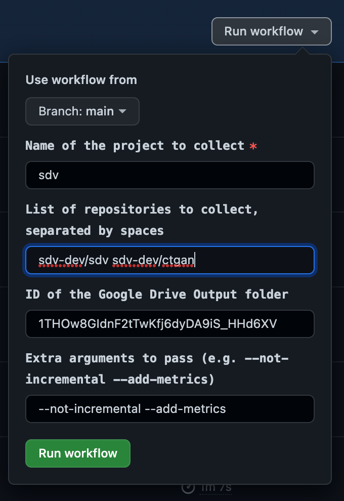

# Usage

The github-analytics repository can be run either locally or through GitHub Actions.
For local usage, see the [README.md](README.md).

Through GitHub Actions, we can trigger manual runs to collect GitHub analytics for specific
repositories, or we can view the regularly-scheduled daily and weekly collections. In this
guide, we cover how to:
1. Trigger a manual workflow to collect GitHub analytics for specific repositories
2. Add one or more repositories to the daily and/or weekly collections.

## Running a manual collection
To run a manual collection, go to the GitHub Actions page of this repository and select 
'Manual Collection', which should bring you to [this page](https://github.com/datacebo/github-analytics/actions/workflows/manual.yaml).

Clicking on the "Run workflow" button will bring up a form of arguments to provide the workflow.
  * **Name of the project folder to collect results into**: This will be the name of the folder
    within the specified GDrive folder that the results of this run will be stored into.
  * **List of repositories (project/repo) to collect, separated by spaces**: Here you can provide
    a list of repositories separated by spaces (e.g. `sdv-dev/sdv sdv-dev/ctgan`). This workflow
    run will collect GitHub analytics for all the specified repositories.
  * **ID of the Google Drive Output folder**: This is the ID of the folder within GDrive that the
    results will be stored into.
  * **Extra arguments to pass**: By default, we will use `--not-incremental` and `--add-metrics`.



In the above example, the GitHub analytics for the `sdv` and `ctgan` repositories within the
`sdv-dev` project will be collected into a folder titled 'sdv' within your specified
GDrive folder.

## Automated cron workflows
In addition to the manual workflow, we also have regularly-scheduled (cron) workflows that run
collectils [daily](https://github.com/datacebo/github-analytics/actions/workflows/daily.yaml) and [weekly](https://github.com/datacebo/github-analytics/actions/workflows/weekly.yaml). 

Each of these workflows has a corresponding configuration file that specifies which GitHub
repositories are collected in which run and where this data is stored. The daily cron job config
is specified in [.github/workflow/daily.yaml](.github/workflow/daily.yaml) and the weekly cron job
config is specified in [.github/workflow/weekly.yaml](.github/workflow/weekly.yaml).

### Configuration file format (config.yaml)

The configuration file for `github-analytics` must have the following contents:

* `output_folder`: Folder where results will be written. Can be a Google Drive in the format
  gdrive://<folder-name>
* `projects`: YAML Dictionary with project names as keys and repository list as values

```yaml
output_folder: <folder-name>
projects:
  <project-name>:
    - <organization>/<repository>
    - <organization>/<repository>
    - ...
  <project-name>:
    - <organization>/<repository>
    - <organization>/<repository>
    - ...
  ...
```

For example, the following config file would only collect data for the `SDV` project,
which would include all the repositories listed, and would store the results inside a
Google Drive folder:

```yaml
output_folder: gdrive://1OPhUPTFWN994QnbcrSojQ9Egf9s7MuHV
projects:
  SDV:
  - sdv-dev/SDV
  - sdv-dev/RDT
  - sdv-dev/SDMetrics
  - sdv-dev/SDGym
  - sdv-dev/Copulas
  - sdv-dev/CTGAN
  - sdv-dev/DeepEcho
```

### Adding new organizations and/or repositories to run on regular cadence
       
In order to add new projects or repositories to the daily or weekly collection, the following
steps must be followed:
       
1. Edit the [config.yaml](config.yaml) file to add the new projects and/or repositories.
2. **To collect data for a Github organization/repository on a daily basis**  Edit the [daily.yaml](daily.yaml) 
   file and add the project name to the list without adding any of the underlying project repositories, since these will be taken from the [config.yaml (config.yaml) file.
3. **To collect data for a Github organization/repository on a weekly basis**  Edit the [weekly.yaml](weekly.yaml)
   file and add the project name to the list without adding any of the underlying project repositories, since these will be taken from the [config.yaml (config.yaml) file.
           
These steps could be done directly via Github UI. 

## Collect data into a **different Google Drive folder**

In order to store data into a different Google Drive folder, get the `Folder ID`. To find the
`Folder ID`, navigate to the folder in Google Drive. The `Folder ID` is everything that comes after
"folder/" in the URL.

To change the output folder in a manual collection run, you can input this `Folder ID` in the
"Run workflow" options. To change the output folder in the daily or weekly run, you can
update the `output_folder` parameter in the configuration yaml file (described above).

### Using different Google Drive Secrets
In order to use a different Google Drive folder, you may have to update the GDrive secrets
being used in the GitHub Actions workflow if the current secrets does not have access to
the desired folder.

1. Get your google drive credentials and upload if necessary (see instructions [here](DEVELOPMENT.md#pydrive-credentials)).
2. Update the `PYDRIVE_CREDENTIALS` in the desired workflow. For example, for the manual workflow,
   update [this line](https://github.com/datacebo/github-analytics/blob/main/.github/workflows/manual.yaml#L45).

## Collect data using a different GitHub access token

It might be necessary to use a different GitHub access token if you want to collect data on
a private repository that the current access token does not have access to.

1. Get the GitHub access token with desired permissions and upload it if necessary
   (see instructions [here](DEVELOPMENT.md#github-actions-setup)).
2. Update references to `GITHUB_TOKEN` and replace with the name of your new GitHub access token.
   For example, to update the manual workflow, update [this line](https://github.com/datacebo/github-analytics/blob/main/.github/workflows/manual.yaml#L39).
